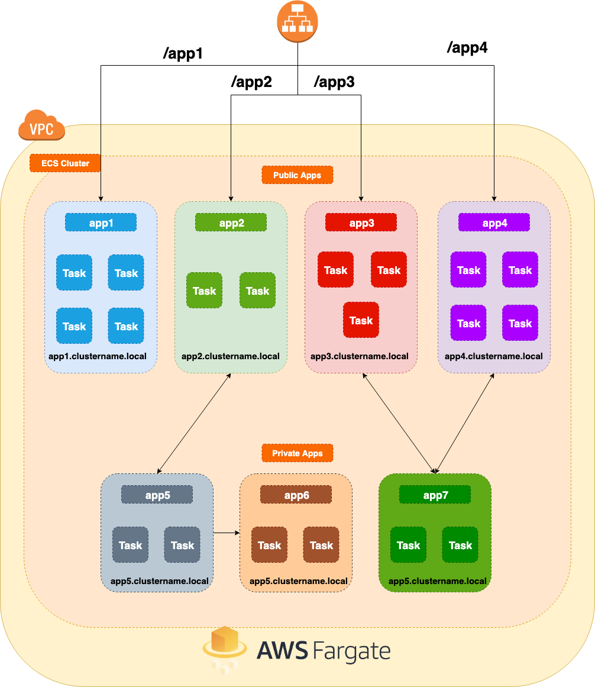

# Microservices Orchestration on ECS


### Complete Microservices Deploy and Orchestration on Amazon ECS using Terraform

Create clusters and services and pipelines on AWS using Terraform.

> This is a incremental evolution from [ecs-pipeline](https://github.com/msfidelis/ecs-pipeline) for big projects with more microservices and service discovery on AWS

AWS Stack Implementation:

* VPC
* ECS Fargate
* Codepipeline
* Codebuild
* Application Load Balancer
* CloudMap


## Architecture 



## Deploy Pipeline

This demo project search for a buildspec.yml on root path from repository. [You can see an example here](https://github.com/msfidelis/microservice-nadave-whois/blob/master/buildspec.yml).


<!--  -->

# How to Deploy

## Edit AWS Configurations

Edit `main.tf`

```hcl
# Customize your AWS Region
variable "aws_region" {
  description = "AWS Region for the VPC"
  default     = "us-east-1"
}

provider "aws" {
  region = "${var.aws_region}"
}

data "aws_caller_identity" "current" {}
```

## Creating a cluster

Edit `clusters.tf` file to customize a cluster preferences. Give infos like ALB basic configurations, AZ's and etc.

```hcl
module "cluster_example" {

    source              = "./modules/ecs"
    vpc_id              = "${module.vpc.vpc_id}"
    cluster_name        = "${var.cluster_name}"

    listener = {
        port     = 8080
        protocol = "HTTP"
        certificate_arn = ""
        ssl_policy      = "" // Default "ELBSecurityPolicy-TLS-1-1-2017-01"
    }

    availability_zones  = [
        "${module.vpc.public_subnet_1a}",
        "${module.vpc.public_subnet_1b}"
    ]

}
```

### Output for ecs

```hcl
output "cluster_id" {}

output "alb" {}

output "listener" {}

```

## Create an Service

Edit `services.tf` and customize an service configurations, like Github sources, containers preferences, alb route path and auto scale preferences.

```hcl
module "service_whois" {
    source          = "./modules/service"
    vpc_id          = "${module.vpc.vpc_id}"
    region          = "${var.aws_region}"

    is_public       = true

    # Service name
    service_name        = "service-whois"
    service_base_path   = "/whois*"
    service_priority    = 400
    container_port      = 8080

    service_healthcheck = {
        healthy_threshold   = 3
        unhealthy_threshold = 10
        timeout             = 10
        interval            = 60
        matcher             = "200"
        path                = "/healthcheck"
        port                = 8080
    }

    # Cluster to deploy your service - see in clusters.tf
    cluster_name        = "${var.cluster_name}"
    cluster_id          = "${module.cluster_example.cluster_id}"
    cluster_listener    = "${module.cluster_example.listener}"
    cluster_mesh        = "${module.cluster_example.cluster_mesh}"

    cluster_service_discovery = "${module.cluster_example.cluster_service_discovery}"

    # Auto Scale Limits
    desired_tasks   = 2
    min_tasks       = 2
    max_tasks       = 10

    # Tasks CPU / Memory limits
    desired_task_cpu        = 256
    desired_task_mem        = 512

    # CPU metrics for Auto Scale
    cpu_to_scale_up         = 30
    cpu_to_scale_down       = 20
    cpu_verification_period = 60
    cpu_evaluation_periods  = 1

    # Pipeline Configuration
    build_image         = "aws/codebuild/docker:17.09.0"

    git_repository_owner    = "msfidelis"
    git_repository_name     = "microservice-nadave-whois"
    git_repository_branch   = "master"

    # AZ's
    availability_zones  = [
        "${module.vpc.public_subnet_1a}",
        "${module.vpc.public_subnet_1b}"
    ]
}
```

### Using Fargate Spot (WAITING FOR TERRAFORM PROVIDER)

Just specify a value `FARGATE_SPOT` on `service_launch_type` parameter. (Default: `FARGATE`)

> To change this value is necessary recreate a service. This is causes downtime on production.

```hcl
module "service_whois" {
    source          = "./modules/service"
    vpc_id          = "${module.vpc.vpc_id}"
    region          = "${var.aws_region}"

    // ...

    service_launch_type = "FARGATE_SPOT"

    // ...
}
```

## How to Deploy

### 1) Github Access Token

* Create your Github Access Token to Command Line. [This link have all information about this](https://help.github.com/articles/creating-a-personal-access-token-for-the-command-line/). 


* Export Github Token as an environment variable. 

```bash
export GITHUB_TOKEN=YOUR_TOKEN
``` 

### 2) Terraform

* Initialize Terraform

```bash
terraform init
```

* Plan our modifications

```bash
terraform plan
```

* Apply the changes on AWS

```bash
terraform apply
```

#### References

* [Easy deploy your Docker applications to AWS using ECS and Fargate](https://thecode.pub/easy-deploy-your-docker-applications-to-aws-using-ecs-and-fargate-a988a1cc842f)

* [ECS Pipeline - By msfidelis](https://github.com/msfidelis/ecs-pipeline)

* [ECS Terraform - By alex](https://github.com/alex/ecs-terraform)

* [Terraform-ECS by arminc](https://github.com/arminc/terraform-ecs)


### Roadmap 

* Appmesh

* Fargate Spot

* Private Services

* Workers

* Bitbucket integrations

* Gitlab integrations


